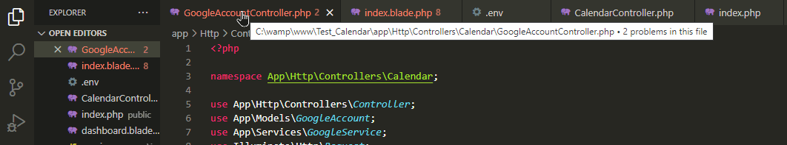

## About tabscolor



This extension lets you color the background of your editor tabs either by right click, by filetype or by directory. Useful when working on a project with multiple tabs. 
The extension is still in an experimental phase.

## How to first use

Install the extension, restart your vs code (not just reload), right click on any tab and select from the color menu

## Set tabs color based on filetypes

example: 
```
"tabsColor.byFileType": {
    "js": {
      "backgroundColor": "yellow",
      "fontColor": "black"
    }
  }
```
Add this to your VS Code user settings.json
## Set tabs color based on directories

example:
```
"tabsColor.byDirectory": {
  "C:\\wamp\\www\\my_project\\css": {
    "backgroundColor": "#00efff",
    "fontColor": "#ffffff"
  }
  }
```
Add this to your VS Code user settings.json
The directoy path must be absolute
## This extension can :

- change the background color of any tab header using the contextual menu

- change the background color of tabs based on filetypes

- change the background color of tabs based on directories

## This extension can't (yet) :

- change the whole background of the tab page

- change the background color of tabs based on regex

- set custom colors in the contextual menu

## Notes :

- this extension uses patching in order to allow tabs style editing, if your vs code files are read-only then Tabscolor may not work.

## Available commands:

- clear all tabs colors

## Contributors Welcome

Don't hesitate to contribute to this extension.

## TODO (in progress)

Add more colors

Add color icons to color options within the contextual menu

Allow custom color options

Sort by color button

